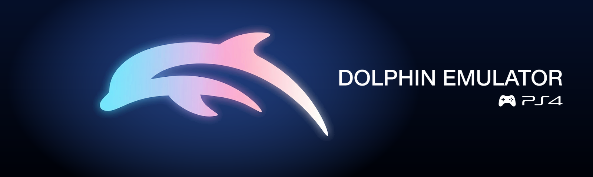

  

  
  
  
  

  <b>Dolphin for PS4</b> is a GameCube and Wii emulator for jailbroken PS4, built on
  <a href="https://dolphin-emu.org">Dolphin</a>, with a PSP-style menu for the TV and the DualShock 4.

  <a href="https://github.com/iHaiDeeZ/DolphinPS4/releases/latest"><b>Download v02.95</b></a> ·
  <a href="#install">Install</a> ·
  <a href="#controls">Controls</a> ·
  <a href="BUILDING.md">Build from source</a> ·
  <a href="CREDITS.md">Credits</a>

---

## What it is

Dolphin for PS4 is a homebrew app (title ID `DLPH00010`) that runs the Dolphin emulator on a
jailbroken PS4. It has a game menu in the style of the PSP's XMB, settings for every game or for
one game, and an in-game menu, all driven with a DualShock 4. Dolphin's x86-64 JIT runs on the
console's CPU, and graphics go through Vulkan on Mesa's RADV driver, talking straight to the PS4
GPU.

It plays your own GameCube and Wii disc backups. It doesn't include any games or BIOS files.

## Features

### The menu
- An XMB in three categories, **Settings**, **Games** and **Themes**: left and right move
  between them, up and down through the items.
- Each game is tagged by system: purple for **GameCube**, white for **Wii**.
- The menu opens on the game you played last.
- A start-up animation plays when the app opens and when you quit a game back to the menu. Any
  button skips it.
- Formats: `.rvz`, `.iso`, `.nkit.iso`, `.gcm`, `.gcz`, `.ciso`, `.wia` and `.wbfs`. Games on
  more than one disc are found by their `(Disc 1)`, `(Disc 2)` names.

### Box art
- Covers download from [GameTDB](https://www.gametdb.com) in the background every time the app
  opens, for any game that doesn't have one yet, GameCube and Wii alike.
- **Settings → Download Covers** fetches them by hand and shows the progress.
- To use your own art, put a PNG named after the game's disc ID in the covers folder.
- GameCube games without a cover show the banner from their disc.

### The game panel
- **Triangle** on a game opens its panel: **Start**, **Game Settings**, **Cheats** and
  **Information**.
- **Game Settings** gives the game its own copy of every setting. Turn it back to *All Games* and
  it follows the global settings again.
- **Cheats** lists the game's Action Replay and Gecko codes; each one turns on or off.

### Settings
Settings are split into sections:

| Section | What's inside |
|---|---|
| **Video** | Aspect ratio, letterbox zoom, widescreen hack, crop to aspect ratio, internal resolution (1x to 3x), frame rate limit (Unlimited, Auto 60/30, 60, 45, 30), V-Sync, FPS counter |
| **Graphics** | Texture filtering, anisotropic filtering, anti-aliasing, disable fog, copy filter, EFB copies, CPU access to EFB, manual texture sampling, shader compilation (asynchronous, hybrid ubershaders, synchronous) |
| **Performance** | Emulated CPU clock (Auto, or 50% to 150%), speed features (Fast or Compatible), dual core, Vulkan thread, fast disc speed, performance graphs |
| **System** | Game volume, Wii extension (Nunchuk or none), sideways Wii Remote, audio buffer |
| **Diagnostics** | All diagnostics, performance log, freeze reports, emulator log, profiler |
| **Controls** | Remap the GameCube controller and the Wii Remote |
| **Menu** | Sound effects and their volume, clock, reset all settings, about |

- **Per-game settings.** Any game can have its own Video, Graphics, Performance, System and
  Diagnostics settings, from the menu or from inside the game.
- **Tuned defaults.** The defaults are the settings tested on a base PS4, and some games come with
  fixes of their own: Wii Sports and Wii Play run without a Nunchuk, sideways games (New Super
  Mario Bros. Wii, Mario Kart Wii, Kirby's Return to Dream Land, Super Smash Bros. Brawl) hold
  the Wii Remote sideways, and a few games get fixes of their own (FIFA Street 2's videos, for
  example, use exact texture sampling).
- **Reset All Settings** puts everything back the way it ships. Your games and saves are kept.

### In-game menu
Press **L3 + R3** together while playing. The game pauses and the menu opens:

- **Resume**
- **Save State** and **Load State**: eight slots, left and right pick one. A message shows while
  the state is written and when it's done.
- **Wii Extension** and **Sideways Wii Remote** (Wii games only): plug the Nunchuk in or out and
  turn the Wii Remote, as on a Wii.
- **Settings**: every setting, applied while you play. The top row, **Apply To**, chooses *This
  Game* or *All Games*.
- **Cheats**
- **Quit Game**: back to the menu.

Button hints are drawn as DualShock 4 icons. Changes are saved, and when you resume the game
ignores the buttons until you let go.

### Themes
- Twelve colour themes: *Dolphin Blue*, *GameCube Indigo*, *Wii White*, *Ocean*, *Emerald*,
  *Lime*, *Gold*, *Sunset*, *Crimson*, *Rose*, *Graphite* and *Midnight*.
- **Your own wallpapers:** PNG images in `/data/DolphinPS4/themes/` show up in the Themes list by
  their file name.
- **Your own sounds:** a WAV in `/data/DolphinPS4/themes/sounds/` with the same name as a menu
  sound (`move`, `category`, `confirm`, `back`, `launch`, `error`, `menu`, `intro`) replaces it.

### Performance
- Dolphin's x86-64 JIT with fastmem and dual core, and Vulkan through RADV on the PS4 GPU, with
  frames flipped by the GPU itself.
- Shaders compile on background threads on cores of their own, with asynchronous compilation or
  hybrid ubershaders, so games stutter less the first time they draw something new. The shader
  cache is kept between runs.
- **Auto CPU clock:** the emulated GameCube CPU clock follows what the PS4 can run at full speed.
  Light scenes get as much of the GameCube's CPU as possible; heavy scenes get a lower clock
  instead of running in slow motion.
- **Frame rate limit, Auto (60/30):** when a game can't hold 60, it shows a steady 30 instead of
  an uneven 45 to 55.

## Requirements

- A jailbroken PS4 with homebrew enabled and a package installer. Developed and tested on a base
  ("fat") PS4.
- A way to copy files to the console, such as FTP.
- **Your own games**, as backups you made from discs you own.
- Optional: an internet connection on the console, for box art.

## Install

1. Download **`DolphinPS4-v02.95.pkg`** from the
   [latest release](https://github.com/iHaiDeeZ/DolphinPS4/releases/latest).
2. Copy it to the PS4 and install it with your package installer.
3. Copy your game backups into **`/data/DolphinPS4/games/`** over FTP. `.rvz` is recommended:
   the smallest files, at no cost in speed (Dolphin on PC converts games: right-click a game →
   *Convert File*).
4. Open **Dolphin** from the home screen. **Settings → About** shows the version.

Box art downloads automatically while the console is online.

### Updating
Install the new package over the old one. Your games, saves, covers and settings live in
`/data/DolphinPS4/` and are kept. Check **Settings → About** to confirm the version.

## Controls

### Menu

| Button | Action |
|---|---|
| D-pad / left stick | Move between categories and items |
| **L1 / R1** | Jump five items |
| **Cross** | Start the game, choose |
| **Circle** | Back |
| **Triangle** | The game's panel: Start, Game Settings, Cheats, Information |

### In a game

| Button | Action |
|---|---|
| **L3 + R3** | Pause and open the in-game menu |
| **Circle** (in the menu) | Back, or resume from the first page |
| **Left / Right** (in the menu) | Change a value, or pick a save state slot |

GameCube controller:

| GameCube | DualShock 4 |
|---|---|
| A / B / X / Y | Cross / Square / Circle / Triangle |
| Z | R1 |
| L / R (analog) | L2 / R2 |
| Start | Options |
| Control stick / C-stick | Left stick / right stick |
| D-pad | D-pad |

Wii Remote and Nunchuk:

| Wii | DualShock 4 |
|---|---|
| A / B | Cross / R2 |
| 1 / 2 | Square / Triangle |
| − / + | L1 / Options |
| Home | Touch pad click |
| Pointer | Right stick |
| Shake | R3 |
| D-pad | D-pad |
| Nunchuk stick / C / Z | Left stick / L1 / L2 |

To set any button yourself, go to **Settings → Controls**, choose GameCube or Wii, press
**Cross** on a row and then the DualShock 4 button you want. Sticks are picked with left and
right. **Reset to Default** brings back the layout above.

## Where things are kept

| Path | What |
|---|---|
| `/data/DolphinPS4/games/` | Your game files |
| `/data/DolphinPS4/covers/` | Box art (`<disc ID>.png`); replace any with your own |
| `/data/DolphinPS4/User/` | Dolphin's data: GameCube saves (`GC/`), the Wii's system memory and saves (`Wii/`), save states (`StateSaves/`), shader cache, controller mappings |
| `/data/DolphinPS4/settings.ini` | Your settings, global and per game |
| `/data/DolphinPS4/xmb.ini` | Menu preferences: theme, wallpaper, sounds, last game |
| `/data/DolphinPS4/themes/` | Your own wallpapers and menu sounds |
| `/data/DolphinPS4/ps4.ini` | Optional advanced options, on top of the built-in defaults |
| `/data/DolphinPS4/*.log`, `*-stacks*.txt` | Logs and reports (see below) |

## Troubleshooting

- **A game runs slowly?** Most slowdowns on a PS4 come from its CPU, not the GPU. Keep the
  **Emulated CPU Clock** on *Auto*. If the frame rate sits between 45 and 55 and feels uneven,
  set **Frame Rate Limit** to *Auto (60/30)*. Keep the **Profiler** off; it costs about 15% speed.
- **A game glitches or freezes?** Set **Speed Features** to *Compatible* in its Game Settings.
- **Short hitches the first time something appears?** Those are shaders being compiled. The cache
  makes the next time smooth; *Hybrid Ubershaders* hides them at some GPU cost.
- **A Wii game asks you to remove the Nunchuk?** Open the in-game menu (L3 + R3) and set **Wii
  Extension** to *None*. The game keeps that setting.
- **No covers?** The console needs to be online when the app opens. A few discs have no art on
  GameTDB; you can add your own.
- **Something went wrong?** Turn on **Settings → Diagnostics → All Diagnostics** (with
  *Performance Log* and *Freeze Reports*), play until it happens, then send these files from
  `/data/DolphinPS4/`:
  - `boot-trace.log` and `dolphin.log`
  - `crash.log`, if the app crashed
  - any `stall-stacks-*.txt`, `boot-stacks-*.txt` or `hang-stacks.txt`

Please [open an issue](https://github.com/iHaiDeeZ/DolphinPS4/issues) with the game, its region,
the version from **Settings → About**, what you did, and those files.

## Tested games

On a base PS4, average frames per second in gameplay:

| Game | FPS |
|---|---|
| Super Mario Sunshine | 30 (the game's own rate) |
| Resident Evil 4 | 30 (the game's own rate) |
| The Legend of Zelda: Twilight Princess | 30 (the game's own rate) |
| Mortal Kombat: Deadly Alliance | 60 |
| Crash Nitro Kart | 60 |
| Crash Tag Team Racing | 60 |
| Sonic Adventure DX | 60 |
| Shadow the Hedgehog | 30–60 |
| Worms 3D | ~55 |
| Super Smash Bros. Melee | 36–60 |
| Crash Bandicoot: The Wrath of Cortex | 20–60 |
| Super Mario Galaxy | 40–57 |
| Wii Sports | ~40 |
| Wii Sports Resort | ~37 |
| FIFA Street 2 | ~34 |

Where there's a range, light scenes reach the high number and heavy scenes drop to the low one.

## Known limitations

- **One player for now.** Only the first DualShock 4 plays; support for up to four players is
  coming in the next version.
- Games that need the Wii Remote's pointer or motion are hard to play on a DualShock 4: the
  pointer is on the right stick and shaking on R3.
- CPU-heavy games can't reach full speed in their busiest scenes on a base PS4. A PS4 Pro hasn't
  been tested.
- Save states are tied to the version that made them; a future update may not load older ones.
  Your in-game saves always carry over.
- Netplay, achievements and texture packs aren't part of the PS4 version.

## Build from source

Dolphin for PS4 builds in WSL or Linux with clang 21, the OpenOrbis toolchain and Mesa's RADV
driver for the PS4 GPU. See **[BUILDING.md](BUILDING.md)**.

## Credits

Dolphin for PS4 was ported by **ShiroKlein**.

It stands on the work of many people. The full list, with licences, is in
**[CREDITS.md](CREDITS.md)**:

- **[Dolphin](https://dolphin-emu.org)** by the Dolphin Emulator Project: the emulator itself,
  started by **F|RES** and **ector** and built by hundreds of contributors, all listed in the
  credits.
- **[Mesa](https://mesa3d.org)** and its **RADV** Vulkan driver, which draws every frame on the PS4
  GPU.
- **[OpenOrbis](https://github.com/OpenOrbis)**, **[PacBrew](https://github.com/PacBrew)** and
  **[LLVM](https://llvm.org)**: the PS4 toolchain.
- **[love-ps4](https://github.com/Mari0/love-ps4)**, whose working PS4 setup this port follows.
- **[GameTDB](https://www.gametdb.com)** and its contributors, for the box art.
- **[Dear ImGui](https://github.com/ocornut/imgui)**, and the **Nunito**, **Questrial** and
  **Michroma** fonts (SIL OFL).

## Legal

> [!IMPORTANT]
> **Dolphin for PS4 does not condone piracy.** It contains no games, no console BIOS or IPL
> files, and no decryption keys, and none will ever be provided or linked to. Play only games you
> own, as backups you made from your own discs.

Dolphin for PS4 is an independent, free and open-source project. It is **not affiliated with,
endorsed by or sponsored by Nintendo, Sony Interactive Entertainment or the Dolphin Emulator
Project**. *Nintendo*, *GameCube* and *Wii* are trademarks of Nintendo. *PlayStation* and *PS4*
are trademarks of Sony Interactive Entertainment Inc. These names are used only to describe
compatibility.

Emulation is provided by Dolphin (GPL-2.0-or-later), and this port is released under the same
licence ([LICENSE](LICENSE)). Box art is downloaded on your console from GameTDB and is not
distributed with the app.
